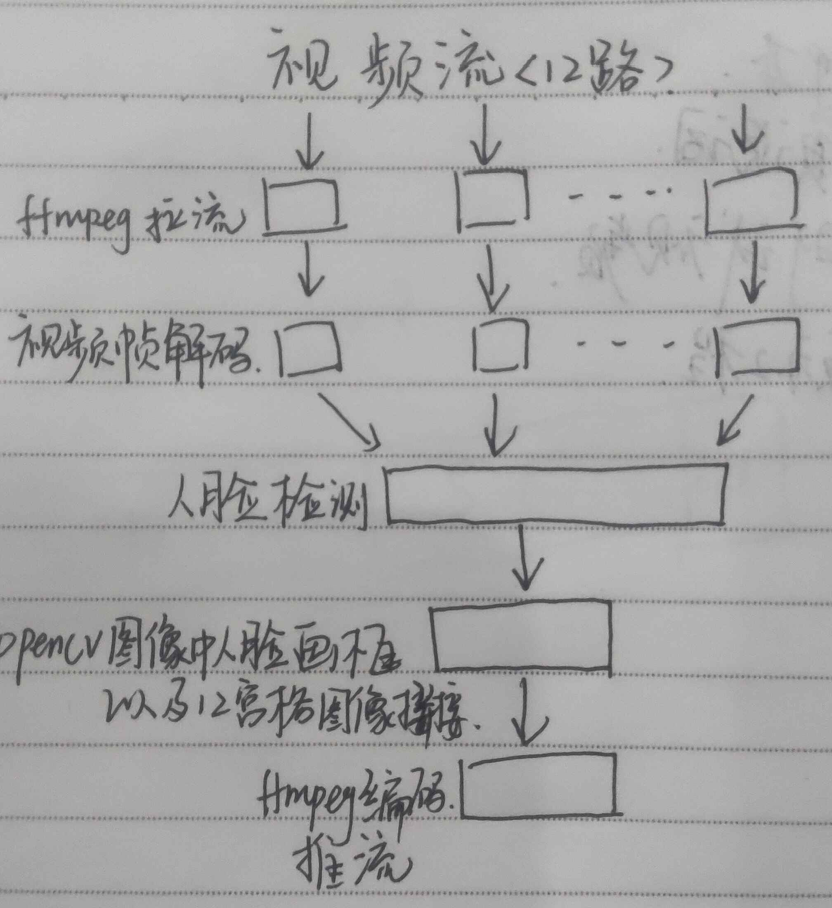

#### 写在开始的话
还没想好这篇博客要表达的重点是什么，暂时先想到哪儿写到哪儿。争取把这个开发过程中，通用的一些性能分析和调优方法讲清楚。

#### 介绍
做这个demo的初衷就是尽可能地发挥硬件的能力，用一块芯片完成12路甚至16路视频的人脸检测。所以，在模型的人脸检测精度达标的情况下，处理速度越快越好，CPU占用率越低越好。（这是一句正确的废话）

#### 业务流程
Talk is cheap, show me the code. 呵呵，代码传不出来。只能先画个流程图。

